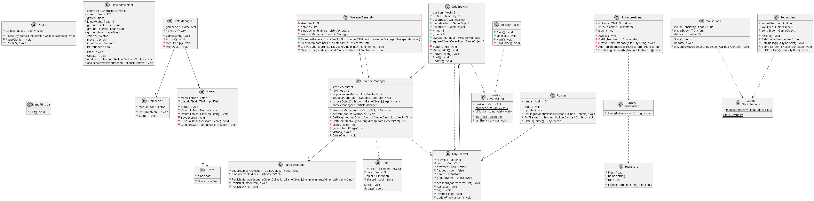

# 3D Minesweeper

This project is a simple minesweeper... in 3D, first person view with an online leaderboard.

Made with Unity.

By Eliaz LE RICHE and Martin MAULUS.

[Playable online with no download](https://play.unity.com/mg/other/webgl-build-482)

## Features : 

Leaderboard relié sur une base de données firebase. 

## Diagramme de classe : 

Note : certaines cardinatlités de certaines classes sont cachés par les flèches.

## En jeu : 
	- si la sensisibilité est trop élevée, allez dans les "Settings" pour la changer
	- ne pas oublier de cocher la case pleine écran
